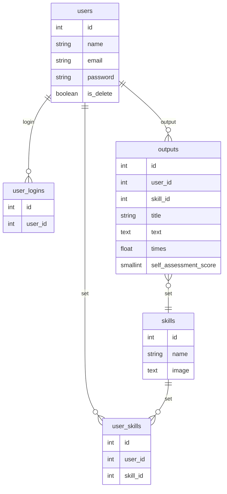

# チームについて
## メンバー一覧
- 武仲計志
- 小松真也
- 大山隆介 

# アプリについて
## 作成アプリ名
Skill Stack

## 概要
学習履歴登録+可視化を行い、学習者のモチベーション向上を図るためのアプリです。

## ワイヤーフレーム
https://app.diagrams.net/#G1zOuH4bzj9jP6lkPasQhFUKfxiailZZ3O

## テーブル設計
## テーブル定義書

users

| カラム名 | カラム説明 | PK | FK | データ型 | NOT NULL | AUTO INCREMENT | DEFAULT | 例 |
| --- | --- | --- | --- | --- | --- | --- | --- | --- |
| id | ユーザーID | ○ |  | int | ○ | ○ |  | 1 |
| name | ユーザー名 |  |  | string | ○ |  |  | ユーザー太郎 |
| email | メールアドレス |  |  | string | ○ |  |  | hoge@hoge.com |
| password | パスワード |  |  | string | ○ |  |  | aodihaidhao(暗号化) |
| is_delete | 退会フラグ |  |  | boolean | ○ |  | 0 | 0:退会していない、1:退会している |

skills

| カラム名 | カラム説明 | PK | FK | データ型 | NOT NULL | AUTO INCREMENT | DEFAULT | 備考・例 |
| --- | --- | --- | --- | --- | --- | --- | --- | --- |
| id | スキルID | ○ |  | int | ○ | ○ |  | 1 |
| name | スキル名 |  |  | string | ○ |  |  | rails |
| image | アイコン画像 |  |  | text | ○ |  |  | url：https://simpleicons.org/ |

user_skills

| カラム名 | カラム説明 | PK | FK | データ型 | NOT NULL | AUTO INCREMENT | DEFAULT | 備考・例 |
| --- | --- | --- | --- | --- | --- | --- | --- | --- |
| id | ユーザースキルID | ○ |  | int | ○ | ○ |  | 1 |
| user_id | ユーザーID |  | ○ | int | ○ |  |  | 1 |
| skill_id | スキルID |  | ○ | int | ○ |  |  | 1 |

outputs

| カラム名 | カラム説明 | PK | FK | データ型 | NOT NULL | AUTO INCREMENT | DEFAULT | 備考・例 |
| --- | --- | --- | --- | --- | --- | --- | --- | --- |
| id | 投稿ID | ○ |  | int | ○ | ○ |  | 1 |
| user_id | ユーザーID |  | ○ | int | ○ |  |  | 1 |
| skill_id | スキルID |  | ○ | int | ○ |  |  | 1 |
| title | タイトル |  |  | string | ○ |  |  | Rails学習1日目！ |
| text | アウトプット(コード、日記、読書感想文の文字数) |  |  | text | ○ |  |  | 今日はめちゃ頑張りました！Hello World!! |
| times | 学習時間 |  |  | float | ○ |  |  | 8時間半であれば8.5 |
| self_assessment_score | 自己評価 |  |  | smallint | ○ |  |  | 1~5 |
| date | 学習日 |  |  | date | ○ |  |  | 2022-03-12 |

targets(時間が余ったら)

| カラム名 | カラム説明 | PK | FK | データ型 | NOT NULL | AUTO INCREMENT | DEFAULT | 備考・例 |
| --- | --- | --- | --- | --- | --- | --- | --- | --- |
| id | 目標ID | ○ |  | int | ○ | ○ |  | 1 |
| user_id | ユーザーID |  | ○ | int | ○ |  |  | 1 |
| skill_id | スキルID |  | ○ | int | ○ |  |  | 1 |
| target_type_id | 目標観点ID |  | ○ | int | ○ |  |  | 1 |
| closing_day | 締切日 |  |  | date | ○ |  |  | 2022-03-30 |
| score | 目標値 |  |  | double | ○ |  |  | 8.5(メンターに質問する！） |

target_types(時間が余ったら)

| カラム名 | カラム説明 | PK | FK | データ型 | NOT NULL | AUTO INCREMENT | DEFAULT | 備考・例 |
| --- | --- | --- | --- | --- | --- | --- | --- | --- |
| id | 目標観点ID | ○ |  | int | ○ | ○ |  | 1 |
| name | 目標観点 |  |  | string | ○ |  |  | “投稿数”、”アウトプットの文字数”、”時間”、”自己評価の合計”など |

achievements(時間が余ったら)

| カラム名 | カラム説明 | PK | FK | データ型 | NOT NULL | AUTO INCREMENT | DEFAULT | 備考・例 |
| --- | --- | --- | --- | --- | --- | --- | --- | --- |
| id | 達成ID | ○ |  | int | ○ | ○ |  | 1 |
| target_id | 目標ID |  | ○ | int | ○ |  |  | 1 |

全テーブル共通

| カラム名 | カラム説明 | PK | FK | データ型 | NOT NULL | AUTO INCREMENT | DEFAULT | 備考・例 |
| --- | --- | --- | --- | --- | --- | --- | --- | --- |
| create_at | データ作成日時 |  |  | datetime | ○ |  |  | 2022-03-12 10:10:10 |
| update_at | データ更新日時 |  |  | datetime | ○ |  |  | 2022-03-12 10:10:10 |

## ER図

## ルーティング・コントローラ
| 画面名・機能名 | ルーティング | コントローラ |
| --- | --- | --- |
| ログイン画面 | GET    /users/sign_in POST   /users/sign_in | devise/sessions#new devise/sessions#create |
| サインアップ画面 | GET    /users/sign_up POST   /users | devise/registrations#new devise/registrations#create |
| ダッシュボード画面 | GET /outputs/dashboard | outputs#dashboard |
| 投稿画面 | GET /outputs/new POST /outputs | outputs#new outputs#create |
| 投稿詳細画面 | GET /outputs/:output_id | outputs#show |
| 投稿編集画面 | GET /outputs/:output_id/edit PUT /outputs/:output_id | outputs#edit outputs#update |
| 投稿一覧画面 | GET /outputs | outputs#index |
| ユーザー設定画面 | GET /users/edit PUT /users | devise/registrations#edit devise/registrations#update|
| スキル登録画面 | GET /skills POST /skills/:skill_id | skills#edit user_skills#create |
| 目標設定画面 |  | 時間が余ったら検討 |
| 目標一覧画面 |  | 時間が余ったら検討 |
| ヘッダー | DELETE /users/sign_out | devise/sessions#destroy |
